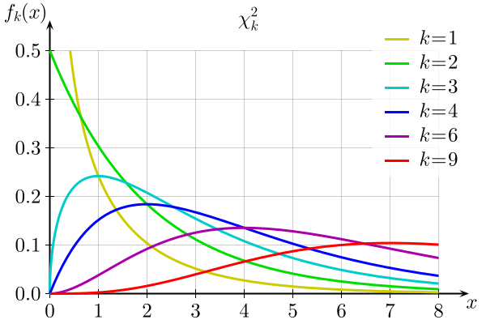

```{r message=F, warning=F, include=F}
library(tidyverse)
```

### Last time

.large[
$$
\begin{aligned}
\text{Admit}_i &\sim Bernoulli(\pi_i) \\
\log \left( \dfrac{\pi_i}{1 - \pi_i} \right) &= \beta_0 + \beta_1 \text{GPA}_i + \beta_2 \text{GRE}_i + \\
& \hspace{0.5cm} \beta_3 \text{Rank2}_i + \beta_4 \text{Rank3}_i + \beta_5 \text{Rank4}_i
\end{aligned}
$$

**Research question:** Is there a relationship between school rank and grad school acceptance, after accounting for GPA and GRE score?
]

---

### Nested models

.large[
$H_0: \beta_3 = \beta_4 = \beta_4 = 0$

$H_A: \text{ at least one of } \beta_3, \beta_4, \beta_5 \neq 0$

**Full model** ($H_A$):

$$
\begin{aligned}
\log \left( \dfrac{\pi_i}{1 - \pi_i} \right) &= \beta_0 + \beta_1 \text{GPA}_i + \beta_2 \text{GRE}_i + \\
& \hspace{0.5cm} \beta_3 \text{Rank2}_i + \beta_4 \text{Rank3}_i + \beta_5 \text{Rank4}_i
\end{aligned}
$$

**Reduced model** ($H_0$):

$$
\begin{aligned}
\log \left( \dfrac{\pi_i}{1 - \pi_i} \right) &= \beta_0 + \beta_1 \text{GPA}_i + \beta_2 \text{GRE}_i
\end{aligned}
$$
]

---

### Comparing nested models

.large[
**Full model** ($H_A$):

$$
\begin{aligned}
\log \left( \dfrac{\pi_i}{1 - \pi_i} \right) &= \beta_0 + \beta_1 \text{GPA}_i + \beta_2 \text{GRE}_i + \\
& \hspace{0.5cm} \beta_3 \text{Rank2}_i + \beta_4 \text{Rank3}_i + \beta_5 \text{Rank4}_i
\end{aligned}
$$

**Reduced model** ($H_0$):

$$
\begin{aligned}
\log \left( \dfrac{\pi_i}{1 - \pi_i} \right) &= \beta_0 + \beta_1 \text{GPA}_i + \beta_2 \text{GRE}_i
\end{aligned}
$$
.question[
How do we compare these two nested models?
]
]

---

### Comparing deviance

```{r, include=F}
grad_app <- read.csv("https://stats.idre.ucla.edu/stat/data/binary.csv")
```


.large[
```{r}
m_full <- glm(admit ~ gpa + gre + as.factor(rank),
              family = binomial, data = grad_app)

m_reduced <- glm(admit ~ gpa + gre,
                 family = binomial, data = grad_app)

m_reduced$deviance - m_full$deviance
```

.question[
How do I know whether this is a big change in deviance? That is: **is a change in deviance of 21.83 unusual under the null hypothesis?**
]
]

---

### Last time: Activity

```{r param_boot, cache=T, echo=F, fig.width=8, fig.height=5}
m_reduced <- glm(admit ~ gpa + gre,
                 family = binomial, data = grad_app)

nsim <- 5000
parametric_boot_stats <- rep(NA, nsim)

for(i in 1:nsim){
  # create a new parametric bootstrap sample
  # (code from question 1)
  admit_star <- rbinom(n = length(m_reduced$y), 
                     size = 1,
                     p = m_reduced$fitted.values)

  sim_data <- grad_app |>
    mutate(admit_star = admit_star)
  
  # re-fit the full and reduced models on the 
  # simulated data
  # (code from questions 2 - 3)
  m_full_sim <- glm(admit_star ~ gpa + gre + as.factor(rank),
                  family = binomial, data = sim_data)
  
  m_reduced_sim <- glm(admit_star ~ gpa + gre,
                  family = binomial, data = sim_data)
  
  # recompute the change in deviance, and save
  parametric_boot_stats[i] <- m_reduced_sim$deviance -
    m_full_sim$deviance
}
```

```{r echo=F, fig.width=8, fig.height=5}
hist(parametric_boot_stats)
```

.large[
.question[
What does this distribution look like?
]
]

---

### Last time: Activity

```{r echo=F, fig.width=8, fig.height=5}
hist(parametric_boot_stats)
```

.large[
.question[
How unusual is the observed test statistic of 21.83, compared to this null distribution?
]
]

---

### p-value

```{r echo=F, fig.width=8, fig.height=5}
hist(parametric_boot_stats)
```

.large[
```{r}
mean(parametric_boot_stats > 21.83)
```
]

---

### Null distribution

.large[
Under $H_0$, $G \sim \chi^2_k$
]

.center[

]

---

### Activity

.large[
* Mean of $\chi^2_k$ is $k$
* Variance of $\chi^2_k$ is $2k$

```{r}
mean(parametric_boot_stats)
var(parametric_boot_stats)
```

]

---

### Drop-in-deviance test (aka likelihood ratio test)

.large[
**Goal:** Compare nested models (full and reduced models)

Steps:

* Calculate deviance for full and reduced models
* Test statistic: $G = \text{deviance}_{\text{reduced}} - \text{deviance}_{\text{full}}$
* Null distribution: under $H_0$, $G \sim \chi^2_q$
]

---

### Activity 1

.large[
Work on the class activity (handout).
]

---

### Activity

.large[
$$
\begin{aligned}
\text{Exercise}_i &\sim Bernoulli(\pi_i) \\
\log \left( \dfrac{\pi_i}{1 - \pi_i} \right) &= \beta_0 + \beta_1 \text{Loss}_i + \beta_2 \text{Smoke}_i + \beta_3 \text{HealthPlan}_i \\ & \hspace{0.5cm} + \beta_4 \text{Age}_i + \beta_5 \text{Height}_i
\end{aligned}
$$

**Research question:** After accounting for the respondent's desired weight loss, is there any relationship between the other explanatory variables and exercise?

.question[
What are my null and alternative hypotheses?
]
]

---

### Activity

.large[
**Full model:**

$$
\begin{aligned}
\log \left( \dfrac{\pi_i}{1 - \pi_i} \right) &= \beta_0 + \beta_1 \text{Loss}_i + \beta_2 \text{Smoke}_i + \beta_3 \text{HealthPlan}_i \\ & \hspace{0.5cm} + \beta_4 \text{Age}_i + \beta_5 \text{Height}_i
\end{aligned}
$$

**Reduced model:**


]

---

### Activity

.large[
**Full model:**

$$
\begin{aligned}
\log \left( \dfrac{\pi_i}{1 - \pi_i} \right) &= \beta_0 + \beta_1 \text{Loss}_i + \beta_2 \text{Smoke}_i + \beta_3 \text{HealthPlan}_i \\ & \hspace{0.5cm} + \beta_4 \text{Age}_i + \beta_5 \text{Height}_i
\end{aligned}
$$

**Reduced model:**

$$
\begin{aligned}
\log \left( \dfrac{\pi_i}{1 - \pi_i} \right) &= \beta_0 + \beta_1 \text{Loss}_i
\end{aligned}
$$
]

---

### Activity

.large[
**Model 1:**

```
    Null deviance: 22680  on 19999  degrees of freedom
Residual deviance: 22036  on 19994  degrees of freedom
```

**Model 2:**

```
    Null deviance: 22680  on 19999  degrees of freedom
Residual deviance: 22531  on 19998  degrees of freedom
```
]

---

### Activity 2

.large[
Work on the class activity (handout).
]

---

### Activity

.large[
```
              Estimate Std. Error z value Pr(>|z|)    
(Intercept) -2.0928484  0.2890071  -7.242 4.44e-13 ***
loss        -1.4520863  0.1500420  -9.678  < 2e-16 ***
smoke100    -0.1339504  0.0334117  -4.009 6.10e-05 ***
hlthplan     0.5940486  0.0478039  12.427  < 2e-16 ***
age         -0.0129321  0.0009882 -13.086  < 2e-16 ***
height       0.0512637  0.0041823  12.257  < 2e-16 ***
```

The standard deviation of the `loss` variable is 0.112.

.question[
How do the odds of exercise change with a one **standard deviation** increase in loss (not a one-unit increase!), holding the other variables constant?
]
]

---

### Activity

.large[
```
              Estimate Std. Error z value Pr(>|z|)    
(Intercept) -2.0928484  0.2890071  -7.242 4.44e-13 ***
loss        -1.4520863  0.1500420  -9.678  < 2e-16 ***
...
```
The standard deviation of the `loss` variable is 0.112.

.question[
Are we confident that a one-standard deviation increase in `loss` is associated with a decrease in the odds of at least 10% (holding other variables constant)?
]

]


